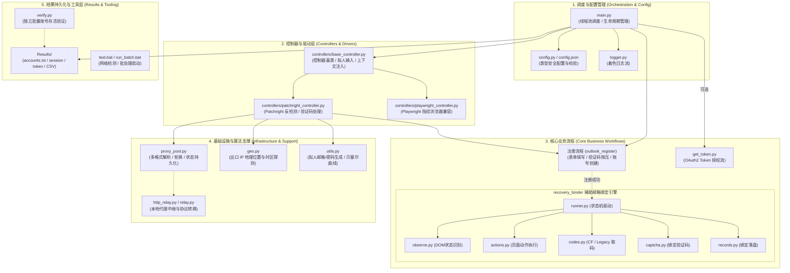
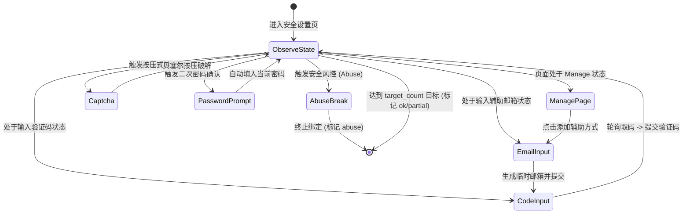
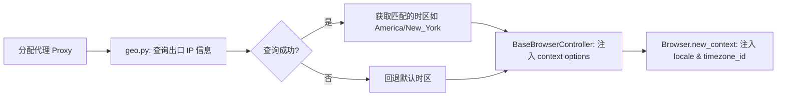
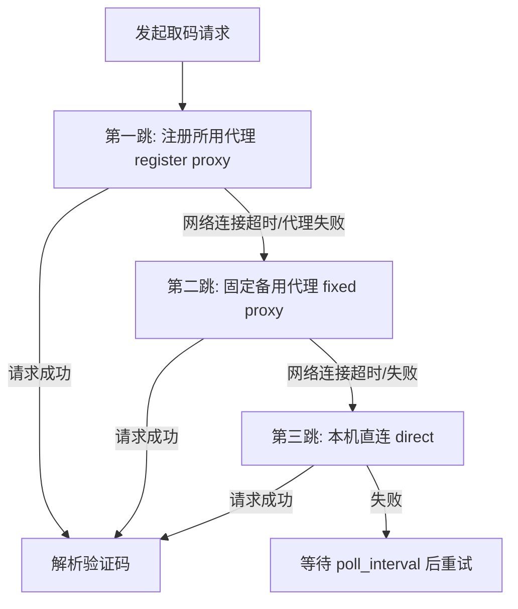

# OutlookRegister 系统架构与技术实现规范 (ARCHITECTURE.md)

本文档面向开发者与架构维护者，全面、深入地阐述 **OutlookRegister** 的系统架构设计、各模块与代码文件的职责边界、关键反检测机制、状态机工作流以及数据持久化规范。

---

## 目录

- [一、系统定位与设计边界](#一系统定位与设计边界)
- [二、全局分层架构与拓扑](#二全局分层架构与拓扑)
- [三、核心模块与全文件职责详析](#三核心模块与全文件职责详析)
  - [1. 调度与配置管理层](#1-调度与配置管理层)
  - [2. 浏览器控制器与反检测驱动层](#2-浏览器控制器与反检测驱动层)
  - [3. 同会话辅助邮箱绑定引擎（recovery_binder）](#3-同会话辅助邮箱绑定引擎recovery_binder)
  - [4. 网络代理与地理时区对齐层](#4-网络代理与地理时区对齐层)
  - [5. 拟人算法与凭据授权层](#5-拟人算法与凭据授权层)
  - [6. 运维、验证与测试工具](#6-运维验证与测试工具)
- [四、关键技术机制深度剖析](#四关键技术机制深度剖析)
  - [1. 浏览器指纹与地理时区对齐机制](#1-浏览器指纹与地理时区对齐机制)
  - [2. 拟人行为模拟与验证码突破](#2-拟人行为模拟与验证码突破)
  - [3. 同会话绑定状态机（Observe-Act Cycle）](#3-同会话绑定状态机observe-act-cycle)
  - [4. 多源取码与三级跳板代理降级链路](#4-多源取码与三级跳板代理降级链路)
  - [5. 代理池轮换与持久化状态机](#5-代理池轮换与持久化状态机)
  - [6. 并发控制与生命周期资源回收](#6-并发控制与生命周期资源回收)
- [五、数据持久化与产物规范](#五数据持久化与产物规范)
- [六、异常处理与容错矩阵](#六异常处理与容错矩阵)

---

## 一、系统定位与设计边界

### 1. 系统定位
OutlookRegister 是一个工业级高健壮性的 **Outlook / Hotmail 自动化批量注册机与安全凭据生成系统**。系统通过高度拟人化的浏览器环境操作，绕过微软的反自动化与风控检测，完成账号注册、同会话绑定备用辅助邮箱，并输出高质量的 Session Cookie 或 OAuth2 Token。

### 2. 设计边界与原则
- **同会话即时绑定（Post-Register Instant Binding）**：辅助邮箱绑定仅在注册成功后的同一活跃浏览器会话中执行，充分利用当前已建立的认证态，免去二次冷登录的风控风险。
- **注册与绑定解耦（Result Independence）**：绑辅助邮箱属于增值流程，绑定环节的任何异常（如无码、验证码阻断、Abuse）均**不会**将已成功的注册标记为失败。
- **线程资源隔离（Thread-Safe Isolation）**：每个并发注册任务拥有独立的浏览器 Context、页面实例及代理连接，状态通过 `threading.local` 进行隔离。
- **零脏数据退出（Guaranteed Teardown）**：无论任务成功、失败或被手动中断（`Ctrl+C`），必须在 `finally` 块中完成 Page、Context 与 Browser 的完全释放，杜绝内存泄漏或孤儿进程。

---

## 二、全局分层架构与拓扑

系统自上而下分为 **调度与配置层**、**控制器抽象与反检测层**、**业务流引擎（注册/绑定）**、**网络代理与拟人算法支撑层** 及 **持久化与输出层**。



---

## 三、核心模块与全文件职责详析

### 1. 调度与配置管理层

#### [main.py](file:///c:/Users/dsk/Desktop/OutlookRegister/main.py)
- **职责**：系统执行主入口与多线程并发调度器。
- **关键函数**：
  - `process_single_flow(controller, config)`：单个注册生命周期的编排，依次执行：获取代理与 GeoIP $\to$ 初始化浏览器 Context $\to$ 执行 `outlook_register` $\to$ （可选）执行 `bind_recovery_emails` $\to$ Session Cookie 或 OAuth2 Token 捕获 $\to$ 记录成功日志 $\to$ 清理资源。
  - `run_concurrent_flows(controller, config, concurrent_flows, max_tasks)`：基于 `ThreadPoolExecutor` 的并发控制循环，负责任务提交、Future 结果回收、进度统计与国家 IP 成功率排行计算。
  - `create_controller(config)`：工厂函数，根据 `choose_browser` 实例化相应的控制器。

#### [config.py](file:///c:/Users/dsk/Desktop/OutlookRegister/config.py)
- **职责**：提供集中式、类型安全的配置加载与合法性校验。
- **关键函数**：
  - `load_config(path)`：读取 `config.json` 并调用 `_validate` 校验。
  - `_validate(data)`：执行严格的约束校验（必填项、浏览器类型限定、邮箱后缀格式、数值范围、OAuth2 关联字段完整性等）。
  - `get_results_dir()`：返回全局 `Results/` 目录绝对路径并确保目录存在。

#### [config.json](file:///c:/Users/dsk/Desktop/OutlookRegister/config.json)
- **职责**：全系统静态与动态运行参数配置仓库（包括代理、浏览器内核、并发数、取码 API 与域名池等）。

#### [logger.py](file:///c:/Users/dsk/Desktop/OutlookRegister/logger.py)
- **职责**：标准化的带颜色终端输出封装，输出带有时间戳、模块前缀和层级颜色的日志。

---

### 2. 浏览器控制器与反检测驱动层

#### [controllers/base_controller.py](file:///c:/Users/dsk/Desktop/OutlookRegister/controllers/base_controller.py)
- **职责**：所有浏览器控制器的抽象基类（`BaseBrowserController`），封装通用行为与拟人化交互逻辑。
- **核心逻辑**：
  - `_build_random_context_options(geo)`：基于 GeoIP 动态配置 Context 的 `timezone_id` 与 `locale`。
  - `human_type(locator, text)`：模拟人类击键，包含字符间随机延迟、偶发性误输入退格纠错。
  - `human_scroll(page)`：模拟人类视线滚屏与随机停顿。
  - `clean_up(page, cleanup_type)`：保证线程安全的页面和浏览器关闭释放。

#### [controllers/patchright_controller.py](file:///c:/Users/dsk/Desktop/OutlookRegister/controllers/patchright_controller.py)
- **职责**：核心控制器，基于 `patchright` 内核（Playwright 的底层反检测 Fork 版），负责真实的注册表单交互与验证码攻防。
- **核心逻辑**：
  - 代理分配：结合 `_proxy_mode`（`single` / `file` / `pool` / `auto`）及独享代理 API 分配代理。
  - `outlook_register(page, email, password)`：驱动 Outlook 注册页，填写账号、密码、姓名、生日、国家/地区等全套流程。
  - `handle_captcha(page)`：识别 Arkose / Funcaptcha / 按压式验证码，利用贝塞尔曲线轨迹和拟人长按完成破解。

#### [controllers/playwright_controller.py](file:///c:/Users/dsk/Desktop/OutlookRegister/controllers/playwright_controller.py)
- **职责**：备用控制器，支持连接外部指纹浏览器（如 AdsPower、Hubstudio 或指定路径的定制 Chromium）。

---

### 3. 同会话辅助邮箱绑定引擎（[recovery_binder/](file:///c:/Users/dsk/Desktop/OutlookRegister/recovery_binder)）

该模块是一个独立的高内聚状态机系统，专门用于在同浏览器会话中为刚注册成功的账号添加备用安全邮箱。



| 模块文件 | 详细职责 |
|---|---|
| [recovery_binder/__init__.py](file:///c:/Users/dsk/Desktop/OutlookRegister/recovery_binder/__init__.py) | 模块外部接口导出：`bind_recovery_emails` 函数与 `BindResult` 数据模型。 |
| [recovery_binder/runner.py](file:///c:/Users/dsk/Desktop/OutlookRegister/recovery_binder/runner.py) | **状态机执行中枢**。维护全局预算超时（`timeout_sec`）、已绑定邮箱列表、当前处理的邮箱对象，通过循环调度 `observe` $\to$ `act` 推动状态跃迁。 |
| [recovery_binder/observe.py](file:///c:/Users/dsk/Desktop/OutlookRegister/recovery_binder/observe.py) | **DOM 状态感知器**。利用多维度 Selector 与正则，精确诊断当前页面停留在哪个节点（`manage_page`、`email_input`、`code_input`、`captcha`、`abuse_break`、`stuck_detect` 等）。 |
| [recovery_binder/actions.py](file:///c:/Users/dsk/Desktop/OutlookRegister/recovery_binder/actions.py) | **具体动作执行器**。封装如 `navigate_security`、`submit_email`、`submit_code`、`handle_password_prompt` 等页面交互。 |
| [recovery_binder/codes.py](file:///c:/Users/dsk/Desktop/OutlookRegister/recovery_binder/codes.py) | **多源取码网络层**。负责 Cloudflare Worker Mail 创建邮箱与轮询拉码、Legacy 自建 API 取码，内置三级跳板（`register` $\to$ `fixed` $\to$ `direct`）降级重试。 |
| [recovery_binder/captcha.py](file:///c:/Users/dsk/Desktop/OutlookRegister/recovery_binder/captcha.py) | **绑定验证码专用处理器**。专门针对微软安全中心添加邮箱时的 Press-and-Hold 挑战进行模拟攻防。 |
| [recovery_binder/config.py](file:///c:/Users/dsk/Desktop/OutlookRegister/recovery_binder/config.py) | **配置适配器**。从全局字典解析出 `BindConfig` 结构体，管理可用域名池与默认超时策略。 |
| [recovery_binder/records.py](file:///c:/Users/dsk/Desktop/OutlookRegister/recovery_binder/records.py) | **绑定数据持久化**。写出 `bind-status.csv`，原子性增量合并并更新 `bind-recovery-map.json`。 |

---

### 4. 网络代理与地理时区对齐层

#### [geo.py](file:///c:/Users/dsk/Desktop/OutlookRegister/geo.py)
- **职责**：查询代理出口 IP 的地理位置（国家、国家代码、时区 `timezone` 与语言 `locale`）。
- **缓存策略**：内置 `_PROXY_GEO_CACHE` 内存字典，避免同一代理节点重复向 `ip-api.com` 发起探测。

#### [proxy_pool.py](file:///c:/Users/dsk/Desktop/OutlookRegister/proxy_pool.py)
- **职责**：代理源的解析、轮换与状态恢复。
- **格式支持**：
  - `ip:port`
  - `ip:port:user:pass`
  - `user:pass@ip:port`
  - `http://...` / `socks5://...`
- **轮换机制**：`ProxyRotator` 实现线程安全的 Round-Robin 算法，并在每轮轮换时将索引保存到 `.proxy_state.json`。
- **独享提取**：支持从第三方 API（如站大爷）按批次动态提取代理。

#### [http_relay.py](file:///c:/Users/dsk/Desktop/OutlookRegister/http_relay.py) / [relay.py](file:///c:/Users/dsk/Desktop/OutlookRegister/relay.py)
- **职责**：本地轻量级代理中继服务器，用于将需要鉴权的远端 SOCKS5 代理转换为本地无鉴权端口，供 Chromium 稳定挂载。

---

### 5. 拟人算法与凭据授权层

#### [utils.py](file:///c:/Users/dsk/Desktop/OutlookRegister/utils.py)
- **拟人邮箱名生成**（`random_email`）：基于 Faker 与动态权重生成自然人邮箱名（如 `flast_num`、`name_year`、`first_last_num` 等），每次调用动态波动概率，杜绝特征化。
- **强密码生成**（`generate_strong_password`）：生成符合微软复杂度要求（大小写字母、数字、特殊符号）的高熵密码。
- **贝塞尔曲线轨迹**（`human_mouse_move`）：使用三次贝塞尔曲线算法（Bezier Curve）计算起点到目标点的鼠标移动控制点与插值点，模拟真人移动的加减速与随机扰动。

#### [get_token.py](file:///c:/Users/dsk/Desktop/OutlookRegister/get_token.py)
- **职责**：Microsoft OAuth2 流程自动化。
- **流程**：利用当前登录态访问 Azure 授权端点 $\to$ 自动点击同意授权 $\to$ 拦截重定向 URL 中的 `code` $\to$ 后台发起 HTTP POST 换取包含 `refresh_token` 与 `access_token` 的完整 JSON 凭据。

---

### 6. 运维、验证与测试工具

| 文件 | 职责说明 |
|---|---|
| [verify.py](file:///c:/Users/dsk/Desktop/OutlookRegister/verify.py) | **独立账号存活验证器**。通过驱动轻量级无头浏览器访问 `login.live.com`，根据页面反馈判定账号是否真实存在并写入 `Results/verify_result.txt`。支持 `--email`、`--file`、`--all`、`--headless` 参数。 |
| [test.bat](file:///c:/Users/dsk/Desktop/OutlookRegister/test.bat) | 批量代理连通性检测脚本。自动调用 `curl` 或 PowerShell 逐行测试 `proxies.txt`，并将可用节点输出到 `Aproxies.txt`。 |
| [run_batch.bat](file:///c:/Users/dsk/Desktop/OutlookRegister/run_batch.bat) | 生产环境 Windows 批处理一键启动入口。 |
| `test_*.py` | 独立测试脚本（`test_socks5.py`、`test_pproxy.py`、`test_relay_https.py` 等），用于排查底层网络与中继连通性。 |

---

## 四、关键技术机制深度剖析

### 1. 浏览器指纹与地理时区对齐机制

微软风控系统最关键的检测项之一为 **浏览器上下文时区/语言与出口 IP 的一致性**。若使用美国代理，但浏览器时区为 `Asia/Shanghai`，会被直接识别为高危机器人。



- **不手动篡改 UA**：Patchright 自带真实 Chrome UA 及完全匹配的 `sec-ch-ua` Client Hints，避免因手动修改 UA 导致版本与底层特性脱节。

### 2. 拟人行为模拟与验证码突破

- **输入拟人化**：[controllers/base_controller.py](file:///c:/Users/dsk/Desktop/OutlookRegister/controllers/base_controller.py) 中的 `human_type` 在敲击每个字符时引入高斯分布延迟，且具有约 3% 的概率模拟“输错字符 $\to$ 停顿 $\to$ Backspace 删除 $\to$ 重新输入正确字符”。
- **鼠标轨迹**：[utils.py](file:///c:/Users/dsk/Desktop/OutlookRegister/utils.py) 的 `human_mouse_move` 采用 3~4 个控制点的贝塞尔曲线计算移动轨迹，包含轻微过冲与抖动微调。
- **按压验证码破解**：[controllers/patchright_controller.py](file:///c:/Users/dsk/Desktop/OutlookRegister/controllers/patchright_controller.py) 与 [recovery_binder/captcha.py](file:///c:/Users/dsk/Desktop/OutlookRegister/recovery_binder/captcha.py) 实现了两阶段智能长按算法（首轮探测按压 $\to$ 观察反馈 $\to$ 动态计算第二轮按压时长）。

### 3. 同会话绑定状态机（Observe-Act Cycle）

辅助邮箱绑定采用了**声明式状态机**设计模式：

$$\text{NextAction} = \mathcal{F}(\text{Observe}(\text{Page DOM}, \text{URL}, \text{Context}))$$

- **状态解耦**：观察器 `observe.py` 仅负责从复杂的 DOM 中提取标准状态枚举（`ManageState`），执行器 `actions.py` 仅负责执行对应动作，驱动器 `runner.py` 负责维护重试计数与超时预算。
- **容错防死锁**：若同一状态连续出现超过 `bind_stuck_dump_after` 次，系统会自动触发页面刷新或状态重置，防止流程在未知弹窗中永久阻塞。

### 4. 多源取码与三级跳板代理降级链路

为了保证辅助邮箱取码的极高成功率，[recovery_binder/codes.py](file:///c:/Users/dsk/Desktop/OutlookRegister/recovery_binder/codes.py) 实现了双源支持与多跳代理自动降级：



- **Cloudflare Mail Worker**：支持动态调用 `/api/new_address` 生成临时邮箱，随后通过 `/api/parsed_mails` 轮询匹配目标验证码。
- **Legacy API**：支持根据邮箱域名映射对应的取码接口，通过精确比对邮件 `to` 字段提取 6 位验证码。

### 5. 代理池轮换与持久化状态机

- **模式切换**：通过 `config.json` 中的 `proxy_mode` 统一调度：
  - `single`：单代理固定模式。
  - `file`：从文件逐行读取，支持多线程争用下的原子索引递增。
  - `pool`：本地端口范围（如 8001~8100）遍历。
  - `auto`：按优先级自动回退。
- **断点续跑**：当前使用的端口号或文件行索引会实时写入 `.proxy_state.json`，即使程序异常终止，下次启动也能紧接着上次的节点继续运行。

### 6. 并发控制与生命周期资源回收

- **并发模型**：基于标准库 `concurrent.futures.ThreadPoolExecutor`，主线程负责监听 Future 队列并动态补齐并发槽位。
- **资源回收**：
  ```python
  try:
      # 执行注册与绑定流程
  finally:
      controller.clean_up(page, "done_browser")
  ```
  在每个线程任务结束时，控制器会显式关闭 Page、Context，并从活跃资源列表中注销，确保系统长时间稳定运行而不发生句柄或内存泄漏。

---

## 五、数据持久化与产物规范

所有运行数据均落盘在 [Results/](file:///c:/Users/dsk/Desktop/OutlookRegister/Results) 目录下：

```text
Results/
├── accounts.txt               # 批次汇总报告与国家 IP 成功率排行榜
├── success_log.txt            # 注册成功明细（含指标参数）
├── outlook_session.jsonl      # Microsoft 认证 Cookies 记录 (JSON Lines)
├── unverified_session.txt     # 未抓取到认证 Cookies 的账号
├── outlook_token.jsonl        # OAuth2 凭据 (Access/Refresh Token)
├── bind-status.csv            # 辅助邮箱绑定流水账
├── bind-recovery-map.json     # 账号 -> 辅助邮箱映射总表
├── all-recovery-emails.csv    # 成功绑定的辅助邮箱全量明细
└── verify_result.txt          # 存活检测工具 verify.py 报告
```

### 关键文件 Schema 范例

#### 1. `outlook_session.jsonl`
```json
{
  "timestamp": "2026-08-26 20:15:30",
  "email": "example3509@hotmail.com",
  "password": "Password123!",
  "auth_cookies": ["RPSTAuth", "MSPAuth", "MSPOK"],
  "cookies": [
    {
      "name": "RPSTAuth",
      "value": "...",
      "domain": ".live.com",
      "path": "/"
    }
  ]
}
```

#### 2. `bind-recovery-map.json`
```json
{
  "example3509@hotmail.com": [
    "temp_recovery_1@dcatalyze.eu.cc",
    "temp_recovery_2@dcarve.top"
  ]
}
```

#### 3. `bind-status.csv`
```csv
time,account,status,email1,email2,emails,note,error
2026-08-26 20:16:05,example3509@hotmail.com,ok,temp1@cf.com,temp2@cf.com,"temp1@cf.com; temp2@cf.com",bound 2/2,
```

---

## 六、异常处理与容错矩阵

| 场景 / 异常类型 | 触发环节 | 系统响应与降级策略 | 最终状态 |
|---|---|---|---|
| **代理连接超时 / 挂掉** | 环境初始化 | 放弃当前任务，记录日志，释放资源，轮换下一代理 | 失败 |
| **注册阶段复杂拼图验证码** | 注册页面 | 触发重试（最多 `max_captcha_retries` 轮），超限后优雅退出 | 失败 |
| **邮箱名已被占用** | 填表阶段 | 捕获页面推荐的候选用户名并自动替换，继续流程 | 正常继续 |
| **绑定阶段取码 API 失败** | 辅助邮箱绑定 | 触发三级跳板降级（`register` $\to$ `fixed` $\to$ `direct`）轮询 | 重试至超时 |
| **微软安全设置 Abuse 封禁** | 辅助邮箱绑定 | 识别 `abuse` 特征，立即终止绑定，注册仍计为成功 | 注册 `True`, 绑定 `abuse` |
| **绑定验证码超时** | 辅助邮箱绑定 | 预算超时退出，已绑成功的邮箱正常记录 | 注册 `True`, 绑定 `partial`/`timeout` |
| **用户主动中断 (`Ctrl+C`)** | 任意运行中 | 捕获 `KeyboardInterrupt`，主线程触发全局清理所有浏览器进程 | 安全退出 |

